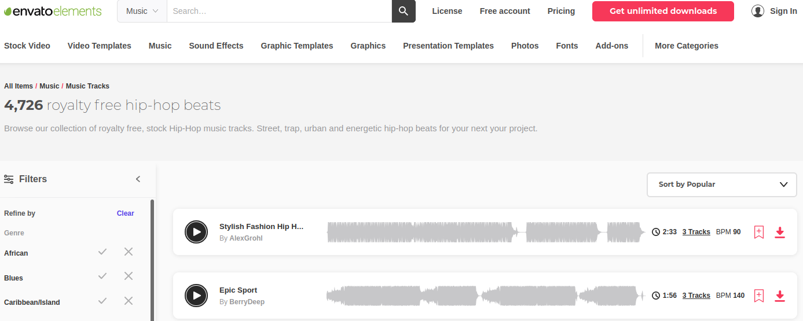
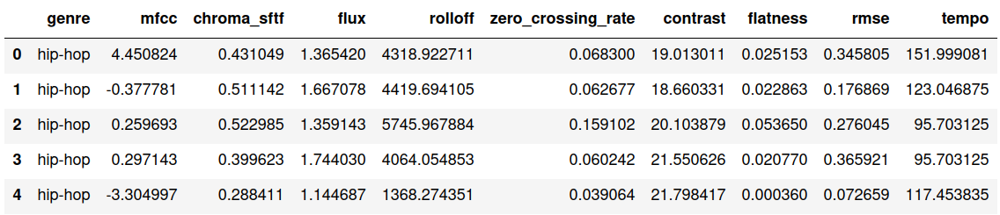
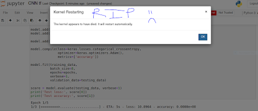

# Song Genre Classification

## Project Description

Classify genres for music songs. 

Using music classification enables platforms to then generate recommendations to their customers (such as Spotify, Soundcloud) or simply as a product (for example, Shazam). Determining music genres is the first step in that direction. Machine Learning techniques have proved to be quite successful in extracting trends and patterns from a large data pool.

## Table of Contents

1. [Overview](#Overview)
    1. [Objectives](#Objectives)
    1. [Background](#Background)
    1. [The Data](#The-Data)
    1. [Project Goals](##Project-Goals)
1. [Data Wrangling](##Data-Wrangling)
1. [EDA](#EDA)
    1. [Importing & DataFraming](##Importing-&-DataFraming)
    
1. [Model Analyses](#Model-Analyses)
1. [Conclusion and Future Steps](##Conclusion-and-Future-Steps)
1. [Visualizations](#Visualizations)
    1. [Slide Deck](https://docs.google.com/presentation/d/1kbqE63oVwSft2N4HKRa9dLJeNabRGMfc8dS3ilGn-oQ/edit?usp=sharing)

# Overview 

## Objectives

1. Attain audio files to classify them by genre 

2. Compare scores of sklearn library classifiers 

3. Building a CNN to classify song files by genre 

## Background

Audio is the product of variations in air pressure over time. These changes are recorded at a specified sample rate, traditionally 44,100 samples per second (44.1 kHz), which gives us waveforms. These waveforms offer large amounts of information within the span of even 1 second.

Python has some great libraries for audio processing like Librosa and PyAudio.There are also built-in modules for some basic audio functionalities.

The librosa library has functions that converts audio signals such that we can know the amplitude of given frequency at a given time and is  used to display spectogram.

Spectrograms are visual representations of a spectrum of frequencies from a signal as it varies over time. Put simply, a spectrogram is a picture depicting audio visually. This process can be seen in the image comparing hip hop to classical, with a wide breath of varying frequencies.

I attained a number of features from the spectral computations, such as the *spectral centroid*. This indicates at which frequency the energy of a spectrum is centered upon or in other words It indicates where the ” center of mass” for a sound is located. what sound you might most likely be tuning in on in any given moment because its the most apparent to our ears.

## The Data

Built a scraper from 
- 3,805 songs  
- 9 extracted audio features 
- 3,805 extracted images
rows by [NUM COLUMNS] columns, containined ___ features. 

We had to clean NaNs

Attained Data from [Envato Elements](https://elements.envato.com/audio/royalty-free-music/hip-hop), which looks like:

## EDA 

1. Initially Trimmed data into 30 second samples of each track.
2. Compute audio features using Librosa functions 
3. Populate results into a dataframe 

After processing the data, I populated the following dataframe and stored as a pickle on my hard drive. 

# Model Analyses

The **baseline case was 20%**, as we had *5 balanced classes* of *761 songs each*. 

I trimmed 30 second clips of the ~4,000 songs evenly across the 5 genres and used them to train deep learning models. Starting from a baseline, the trained sklearn models reached a median score of approx 60%. 

## Findings

# Visualizations
1. [Slide Deck](https://docs.google.com/presentation/d/1kbqE63oVwSft2N4HKRa9dLJeNabRGMfc8dS3ilGn-oQ/edit?usp=sharing)

# Music-Genre-Classification

## Table of Contents
[Overview](#overview) 
[So what is Audio Signal Processing?](#asp) 
[Data Preparation](#data-prep) 
[EDA](#EDA) 
[Modeling](#modeling) 
[Summary](#summary) 
[References](#references) 

The dataset used for this project has 30 second clips of 8000 songs, equally balanced across 5 genres:
- Electronic
- Hip-Hop
- Classical
- Country
- Rock

In order to use this data to train a deep learning model, we will need to convert it into a format that the model can use. For this project, we will use audio signal processing tools and concepts to convert the audio into numerical data of frequencies and waveform images (which can both be used to train models).

These waveforms can be stored in mp3's, wav files, and other audio file formats. This brings us to our starting point, with our data being stored in a .mp3 file format. The first issue to address is how to convert our data into a palatable format that can be input into deep learning models, as they cannot process raw audio data. In order to overcome this, I transformed the audio into mel spectrograms like the one shown below.

Therefore, after generating the spectrogram, the frequency (y-axis) is mel-scaled accordingly. This can be seen in the graph above as the frequency follows a logarithmic trend as it increases.

By using mel spectrograms for  deep learning models, we feed in a visual format which CAN allow audio to be processed through a neural network.  and they are scaled in such a way that the data is represented in a format similar to how a human would perceive the sound. With this knowledge, we can now safely go into how the data was preprocessed and prepared for modeling.

## <a name="data-prep">Data Preparation</a>
Because we are dealing with audio files, the data could not simply be loaded into a dataframe and manipulated. Instead, I began by first writing scripts to properly access audio files from their nested directories. 

The data was pre-trimmed into 30 second samples so I was able to convert the data directly into mel spectrograms using the Librosa python package. I then took the matrices representing the spectrograms and stored them in an array with their corresponding genre. This was the final format that was used to store the feature and target data for modeling.

## <a name="EDA">EDA</a>
After preparing the data for modeling, I took some time to explore the metadata associated with the ~4,000 songs from the dataset. 

I also plotted the average song length per genre. There was a surprising amount of variation with the longest genre, International, being over 50 seconds longer than the shortest genre, Hip-Hop. For our purposes, this should not have any effect on our modeling since we're using 30 second samples for each song.

## <a name="modeling">Modeling</a>
I began modeling by establishing a baseline using a dummy classifier which made predictions at random. I elected to use accuracy as my main metric for gauging performance since we want the models to predict all genres equally well and there are no differing rewards/penalties associated with the accuracy for predicting any one genre. Given that we have 8 genres, it makes sense that the dummy classifier had an accuracy of 13% (roughly one in eight).

After the initial sklearn classifier models, I went about developing my own  2D convolutional neural network (CNN) to process the  mel spectrogram images. Unfortunately, I went on to find out the **CNN was too computationally expensive**, and my computer kept crashing whilst trying to run it.

After spending 1-2 days of work time after hitting a wall on the CNN, I was under time constraints and pivoted to solely reporting the classifier models mentioned above. 

ran sklearn classifier models originally, and used gridsearch to hypertune parameters for optimal performance. 

## Conclusion and Future Steps
Overall, this project was not the great success I was initially striving for. 

Although hypertuning the hyperparameters for the sklearn libraries did **significantly outperform the baseline** (~60% vs. 20%), the model had a lot of opportunities for improvement.

I would expect with a fully functioning CNN model I could further improve performance.

 by 36% with a maximum validation accuracy of 49%. During this process, I also learned a lot about (audio) signal processing, which is its own field of study altogether.

I firmly believe that this model, in its current architecture, can perform much better if it is given a larger, better dataset to train with. ~4,000 data points is not much to work with, especially for training neural networks. Some next steps for this project would be using the larger, imbalanced datasets from FMA[**1**](https://github.com/mdeff/fma) to see how the model performs. I'd also like to toy around with partitioning the audio samples into smaller snippets to increase sample size, although that  may affect the model's ability to study long-term temporal effects in the audio.

I continuously ran into a number of errors when running the CNN. As seen by the listed shapes, we have a larger set of information for each song. 

this was the first time experiencing technical difficulties due to limited memory. in the future i would put a lot more planning and forethhought into data storage management and processing. either attaining some aws credits or purchases, or weston also recommended using Google Colab for doing everything related to Neural networks because it is free and provides GPUs and TPUs as runtime environments.

1. Data storage / GPU processing.
- I would leverage the asset of cloud computing as opposed to everything on my local computer.
2. Cleaner Data
- there was overlap in the data as the site would include songs that contained both genre tags. Additionally, this was royalty-free music, and not conventionally tracks that anyone may be familiar with. 

____
Link to [Slide Deck](https://docs.google.com/presentation/d/1kbqE63oVwSft2N4HKRa9dLJeNabRGMfc8dS3ilGn-oQ/edit?usp=sharing)

## <a name="references">References</a>

1. [Webscrape Source](https://elements.envato.com/audio/royalty-free-music/hip-hop)
2. [Waveform Visualization](https://deepmind.com/blog/article/wavenet-generative-model-raw-audio)
3. [Spectrogram Definition](https://en.wikipedia.org/wiki/Spectrogram#:~:text=A%20spectrogram%20is%20a%20visual,they%20may%20be%20called%20waterfalls.)
4. [Fast Fourier Transform Visualization](https://www.mathworks.com/help/dsp/ref/dsp.stft.html)
5. [Mel Scale Formula](https://en.wikipedia.org/wiki/Mel_scale)
6. [os Documentation](https://docs.python.org/3/library/os.html)
7. [Librosa Documentation](https://librosa.org/doc/latest/index.html)
8. [Frequency Range Thresholds](https://www.cuidevices.com/blog/understanding-audio-frequency-range-in-audio-design)